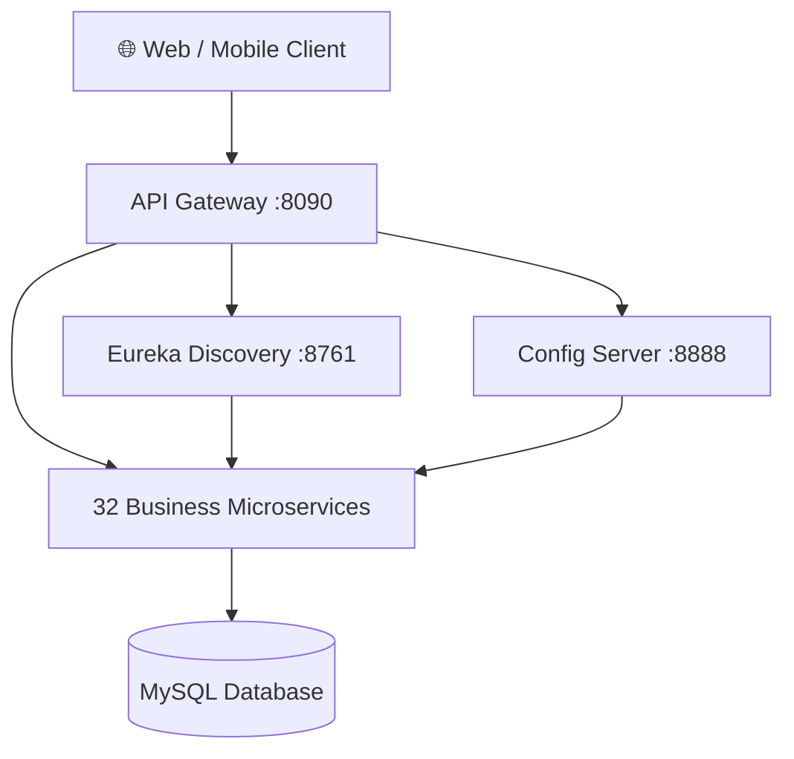

# 🏗️ ETEC University — Backend

**Microservice architecture** for the ETEC university platform. Distributed backend powered by Spring Boot 3.5 with Spring Cloud, orchestrated through API Gateway, Discovery Service, and Config Server.

---

## 🏛️ Architecture



**Flow:** Client → API Gateway → Eureka Discovery → Microservice → MySQL

---

## 🛠️ Tech Stack

| Technology | Version |
|------------|---------|
| Java | 21 |
| Spring Boot | 3.5.14 |
| Spring Cloud | 2025.0.0 |
| Spring Cloud Gateway | ✓ |
| Eureka Discovery | ✓ |
| Spring Cloud Config | ✓ |
| JPA / Hibernate | ✓ |
| MySQL | 8.x |
| Maven | ≥ 3.9 |
| Lombok | ✓ |

---

## 🚀 Getting Started

### Prerequisites

```bash
# Check local versions
java --version            # Java 21+
mvn --version             # Maven 3.9+
mysql --version           # MySQL 8.x
```

- **Java 21** (JDK)
- **Maven** ≥ 3.9
- **MySQL** 8.x with `siteetec` database created
- **Node.js** (optional, for frontend)

### Infrastructure (start order is required)

Run these from the project root (`/backend/`) in this exact order:

```bash
# 1. Config Server (port 8888)
mvn spring-boot:run -pl config_server -DskipTests -q

# 2. Discovery Service / Eureka (port 8761)
mvn spring-boot:run -pl discovery_service -DskipTests -q

# 3. API Gateway (port 8090)
mvn spring-boot:run -pl api_gateway -DskipTests -q
```

### Business Microservices

After infrastructure is up, start the services you need (each service = independent process):

```bash
# Core services
mvn spring-boot:run -pl actualite -DskipTests -q     # News
mvn spring-boot:run -pl admin -DskipTests -q          # Administration
mvn spring-boot:run -pl utilisateur -DskipTests -q    # Users / Auth
mvn spring-boot:run -pl coursenligne -DskipTests -q   # Online courses
mvn spring-boot:run -pl note -DskipTests -q           # Grades
mvn spring-boot:run -pl presence -DskipTests -q       # Attendance
mvn spring-boot:run -pl empoiDuTemps -DskipTests -q   # Schedule

# Support services
mvn spring-boot:run -pl notification -DskipTests -q   # Notifications
mvn spring-boot:run -pl email -DskipTests -q          # Emails
mvn spring-boot:run -pl messagerie -DskipTests -q     # Messaging
mvn spring-boot:run -pl visio -DskipTests -q          # Videoconference
mvn spring-boot:run -pl quiz -DskipTests -q           # Quizzes
mvn spring-boot:run -pl progression -DskipTests -q    # Progress tracking
mvn spring-boot:run -pl common -DskipTests -q         # Shared library
```

### Full Build

```bash
# Build all modules (skip tests)
mvn clean install -DskipTests

# Quiet mode (reduced logs)
mvn clean install -DskipTests -q
```

---

## 📋 Microservices

### Infrastructure

| Module | Port | Role |
|--------|------|------|
| `config_server` | 8888 | Centralized configuration |
| `discovery_service` | 8761 | Eureka Service Registry |
| `api_gateway` | 8090 | Single entry point, routing, auth |

### User Management

| Module | Spring App | Role |
|--------|-----------|------|
| `utilisateur` | `UTILISATEUR` | Auth, users, JWT |
| `admin` | `ADMIN` | Admin management |
| `Etudiant/etudiant` | `ETUDIANT` | Student profiles |
| `Enseignant/enseignant` | `ENSEIGNANT` | Teacher profiles |
| `profile` | `PROFILE` | User profiles |
| `Encadreur/encadreur` | `ENCADREUR` | Academic supervisors |

### Education

| Module | Spring App | Role |
|--------|-----------|------|
| `coursenligne` | `COURSENLIGNE` | Courses, chapters, lessons, resources, videos |
| `note` | `NOTE` | Student grades |
| `moyenne` | `MOYENNE` | Grade averages |
| `matiere` | `MATIERE` | Subjects taught |
| `filiere` | `FILIERE` | Programs / tracks |
| `niveau` | `NIVEAU` | Levels (L1, L2, L3, M1, M2) |
| `semestre` | `SEMESTRE` | Academic semesters |
| `univesitaire` | `UNIVESITAIRE` | Academic years |
| `domaine` | `DOMAINE` | Fields of study |
| `memoire` | `MEMOIRE` | Final year projects |
| `devoir` | `DEVOIR` | Assignments |
| `quiz` | `QUIZ` | Quizzes and assessments |
| `progression` | `PROGRESSION` | Progress tracking |
| `enligne` | `ENLIGNE` | Online training |
| `emploiDuTemps` | `EMPLOIDUTEMPS` | Schedules |

### Communication & Content

| Module | Spring App | Role |
|--------|-----------|------|
| `actualite` | `ACTUALITE` | News and announcements |
| `notification` | `NOTIFICATION` | Push notifications |
| `email` | `EMAIL` | Email sending |
| `messagerie` | `MESSAGERIE` | Internal messaging |
| `visio` | `VISIO` | Videoconferencing |
| `president` | `PRESIDENT` | President's messages |
| `slides` | `SLIDES` | Slides / carousel |
| `organigramme` | `ORGANIGRAMME` | School organization chart |
| `historique` | `HISTORIQUE` | School history |
| `presence` | `PRESENCE` | Attendance tracking |

---

## ⚙️ Configuration

### Database

```properties
# All microservices connect to the same MySQL database
spring.datasource.url=jdbc:mysql://localhost:3306/siteetec?useSSL=false&serverTimezone=UTC
spring.datasource.username=root
spring.datasource.password=<your-password>
spring.jpa.hibernate.ddl-auto=update
```

### Config Server (optional)

Microservices can read configuration from the Config Server (`:8888`) or use their local `application.properties`:

```properties
spring.config.import=optional:configserver:http://localhost:8888
```

### Dynamic Ports (Eureka)

Microservices use `server.port=0` for random port assignment. Eureka handles automatic discovery.

---

## 🔌 API Gateway

Single entry point: `http://localhost:8090`

The Gateway:
- Routes requests to microservices via Eureka (`lb://SERVICE_NAME`)
- Filters JWT authentication
- Centralizes CORS, rate limiting

### Main Routes

```yaml
/auth/**         → lb://UTILISATEUR
/api/admins/**   → lb://ADMIN
/api/etudiants/** → lb://ETUDIANT
/api/enseignants/** → lb://ENSEIGNANT
/api/cours/**    → lb://COURSENLIGNE
/api/actualites/** → lb://ACTUALITE
/api/notes/**    → lb://NOTE
... 20+ more routes
```

---

## 🧪 Development

### Useful Commands

```bash
# Run a specific service with dev profile
mvn spring-boot:run -pl <module> -Dspring-boot.run.profiles=dev

# Build without tests
mvn clean install -DskipTests

# Watch service logs
tail -f logs/<module>.log
```

### Best Practices

- **Naming**: Use UPPERCASE `spring.application.name` for Eureka registration
- **Entities**: Annotate with `@Table(name = "prefix_name")` to avoid conflicts
- **Ports**: Use `server.port=0` for Eureka-registered services
- **Exceptions**: Use `GlobalExceptionHandler` from the `common/` module

---

## 🔗 Frontend

The React UI is located in [`../frontend/`](../frontend/).

```env
VITE_API_GATEWAY_URL=http://localhost:8090
```

---

## 📄 License

Private project — ETEC University
